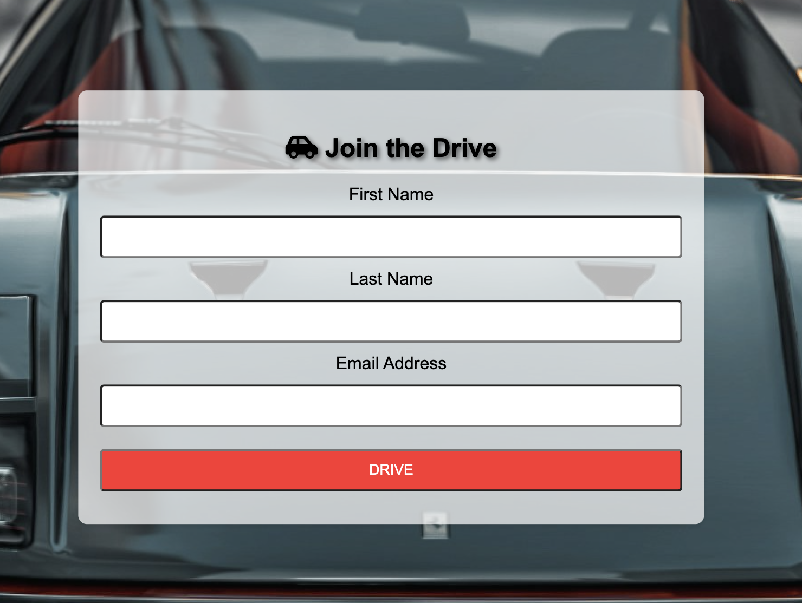

# Elias Ödmark

[View deployed site here](https://odmarken.github.io/Cars-and-Coffee/)

## Welcome 

 The "Cars and Coffee" HTML page is thoughtfully designed to be both user-friendly and engaging, ensuring a delightful experience for every visitor. As soon as users land on the page, they are welcomed by a large, captivating image that perfectly captures the essence of cars and coffee events, setting an exciting tone for their visit. Accompanying this image is a short, friendly welcome message that introduces the site, creating a warm and inviting atmosphere right from the start.

The website is neatly divided into distinct sections, each dedicated to different aspects of the Cars and Event experience. Visitors can explore featured cars, delve into favorite coffee blends, and discover upcoming events. Each section is clearly titled, making it straightforward for users to find the information that interests them the most.

Enhancing the user experience further is a conveniently placed menu at the top of the page. This menu remains accessible as users scroll, allowing them to effortlessly navigate to various sections of the site at any point in their journey. This thoughtful design element ensures that users can smoothly and quickly transition between different parts of the page, enhancing their overall experience and engagement with the content.

## Header

- The navigation bar maintains a consistent design and placement across all pages, facilitating user navigation. It features a distinctive logo, links to the Home page, Menu for coffee and Member sections

- The logo and design are neat in a black and white scheme, with an (fa-car) icon on smaller devices instead of text

- When viewed on smaller devices, the 'fa-car' icon will appear and is easy to click on

## Navigation

- Everything is centered in the middle for easy navigation throughout the entire website

- When viewed on smaller devices or tablets, a car icon will appear for a sleeker look, also matching the 'cars and coffee' theme.

- The different pages are Home, Menu, and Member, which are simple and easy to navigate through, making it easier to understand and view.

- A neat footer at the bottom displays all the social media links.

## Design

- I chose the red, white, and black color scheme to make it unique and pop, yet also subtle. White is the main color, with black for text and borders, and red for all the panels and hovers.
- A favicon is used for a neat design and added fun. I chose a small car to match the theme.

## Technologies

- HTML5
- CSS3
- [Google Fonts:](https://fonts.google.com/) font used is "Pridi".
- [Font Awesome:](https://fontawesome.com/) is used on header and form sign up and also footer.

## Sections

### Home

- The homepage is the first thing visitors see when they come to the website, and it introduces them to a welcoming and friendly background showcasing one of our successful car shows.
- An event section is prominently displayed on the front page and also features a hover effect to make it stand out a bit more.

### Menu

-  The menu page displays a variety of classic and well-known coffee types that are offered at the car event. 
- Additionally, the menu features a nice hover effect to enhance its visual appeal.

### Member

- The Member page is where you can sign up to become an active member, join the community, and receive daily updates about all the upcoming events.
- The form in the member section is easy to navigate and understand, and it also includes a favicon to enhance the design.

## Testing

- I have rigorously tested the website on various browsers, including Firefox, Safari, Chrome, and Opera GX, and they all work flawlessly.
- I've tested it on different devices such as phones, tablets, a MacBook Pro, Windows 11, and also an iMac.
- Additionally, I have tested the website using Chrome's developer tools to ensure it functions correctly across all resolutions, including the iMac Pro's 5120 x 2880 resolution.
- Navigation elements are placed in their appropriate locations throughout the website.
- Footer navigation elements are correctly positioned where they belong, and they open in a new browser tab.
- The form accurately validates fields that are marked as required, ensuring no essential information is omitted.
- The form also checks the format of email addresses, confirming they adhere to the standard email structure.
- All data entered into the form is successfully transmitted to the designated formdump for processing and storage.

## Validators CSS/HTML

## Deployment

- In the GitHub repository, navigate to the Settings tab, choose Pages from the left hand menu 
- From the source section drop-down menu, select the Master Branch once the master branch has been selected, the page will be automatically refreshed with a detailed display to indicate the successful deployment
- Changes pushed to the master branch will take effect on the live project

[Cars&coffee](https://github.com/Odmarken/Cars-and-Coffee/blob/main/index.html) 

## Bugs and known issues

- I had a lot of problems initially with scaling my images, but the issue was that I hadn't set my images as the background. This has now been fixed, and the images scale better on various screens. My mentor, Brian, helped me resolve this and explained it very well.

## Coding help

- I received a lot of help from the lovely community at CI Community-Sweden. The Slack group has been amazing when it comes to assistance. Every time I have been stuck, they have responded within minutes. We also have multiple huddles that helps a lot from experienced coders.
- Youtube.
- Google
- Close friends

## Credits

- Slack group community-sweden in CI slack group.
- Brian my mentor.
- Aaron Jack yotube (https://www.youtube.com/@AaronJack/videos)
- The Thrive project (https://github.com/elainebroche-dev/ms1-thrive)
- The Bonsai page fellow swede (https://github.com/mittnamnkenny/bonsai-page/tree/main)
